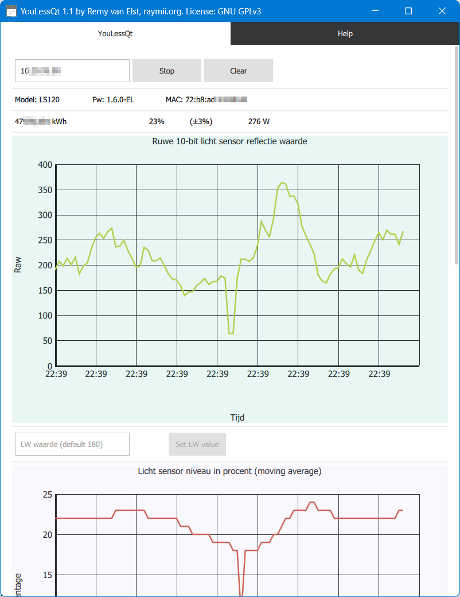

# YouLessQt

**Dit is een onofficiele applicatie, niet door YouLess /
PostFossil gemaakt.**

Helpt de YouLess energiemeter goed op de analoge
(draaischijf) meter plakken door de ruwe sensorwaarde
en relevante sensorwaardes te tonen zodat men kan zien
wanneer een puls gedetecteerd wordt, zonder een Windows 7
gadget te installeren. Ook is hiermee de LS waarde direct
aan te passen op de YouLess, waarna het effect direct in
de grafiek te zien is. Gezien dit een Android applicatie is
(evenals Windows) is dit makkelijker direct in de meterkast
te gebruiken dan een PC gadget.

Ik heb deze applicatie in een paar avonden in elkaar gezet omdat
de YouLess pulsen miste van mijn draaischijf. Na een paar keer
opnieuw plakken en juist uitlijnen werden er geen pulsen meer
gemist.

Vul het IP of de hostname van de YouLess in, druk op Start en
de grafieken worden zichtbaar, evenals wat model informatie
(MAC, firmware, etc) en de ruwe waardes. De rode stip geeft
aan dat er een puls gedetecteerd is. Met de 'Set LS' knop
kun je LS waarde (zoals hieronder beschreven) direct instellen.

De huidige LS waarde is niet op te vragen via de API, de default
is 180.

Meer informatie over deze methode:

https://gathering.tweakers.net/forum/view_message/43732209

Quote:

> In België zijn analoge elektriciteitsmeters vaak in een extra
(semi)transparant kunstof kast ondergebracht. Is die bij jou ook het geval?

> De afstand tussen Youless en draaischijf is daardoor vaak groter dan
zonder de plastiek kast. Door het zwakkere signaal is het vaak nodig om
de gevoeligheid van de Youless gevoeliger af te stellen voor deze situatie.

> Wij hebben een Windows tool (in de vorm van een Windows gadget) waarmee
de reflectie van de draaischijf zichtbaar gemaakt kan worden in een
grafiek. Deze tool is behulpzaam zijn bij het afstellen van de
gevoeligheid Deze tool kan hier worden gedownload:

>> http://www.youless.nl/tl_files/downloads/rawmon-0.2.zip

> Indien u Windows 8 gebruikt, dan kan de raw monitor gadget worden
gebruikt met behulp van de 8gadget pack:

> http://www.youless.nl/blogpost/items/gadget-windows-8.html

> De Youless werkt zo dat hij standaard een dip in de gereflecteerde
lichtsterkte van ongeveer 45% als een puls telt. Met de Windows tool
ziet de grafiek er normaal gesproken zo uit:

> Er is hier duidelijk een korte scherpe dip te zien in het signaal
wanneer het streepje langskomt. Hoe duidelijker de dip (relatief)
zichtbaar is hoe beter. Als het gemiddelde input niveau zelf laag is, is
dat op zich overigens geen probleem. Als de dip maar goed te
onderscheiden is.

> Deze dip zal door de grotere afstand minder duidelijk zijn indien er
sprake is van een extra plastiek kast. De drempelwaarde parameter lw kan
worden bijgesteld door de volgende url in een browser in te geven (het
voorbeeld IP adres 1.2.3.4 dient hier nog vervangen te worden door het
eigen Youless IP adres) :

> http://1.2.3.4/M?lw=105

> Wat dit betekent is dat de Youless een dip van 100/105=0.95 (ofwel een
5% relatieve daling) van het gemiddelde reflectieniveau als een puls zal
zien. Af fabriek is de waarde van lw gelijk aan 180, dus met 105 is de
gevoeligheid flink hoger. De waarde van lw moet tenminste 101 zijn.

> De voorgestelde parameter waarde 105 werkt meestal goed bij meters in
een extra plastiek kast. Vanuit de reflectie grafiek kan indien nodig
worden afgeleid wat een optimale waarde is voor lw.

> Mocht u nog vragen hebben, laat het ons dan gerust weten.

Einde Quote

Als extra aanvulling een plaatje van de RawMon widget
waarbij er geen pulsen gedetecteerd worden:

[Bron](https://gathering.tweakers.net/forum/view_message/54740479)

License: GNU GPLv3

Author: Remy van Elst (https://raymii.org).

